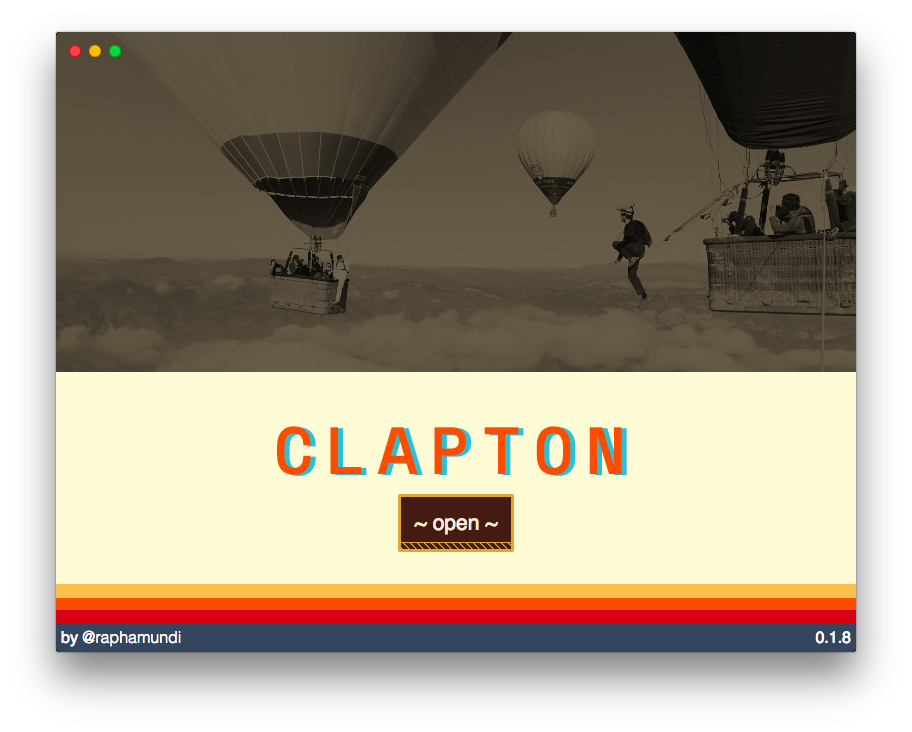
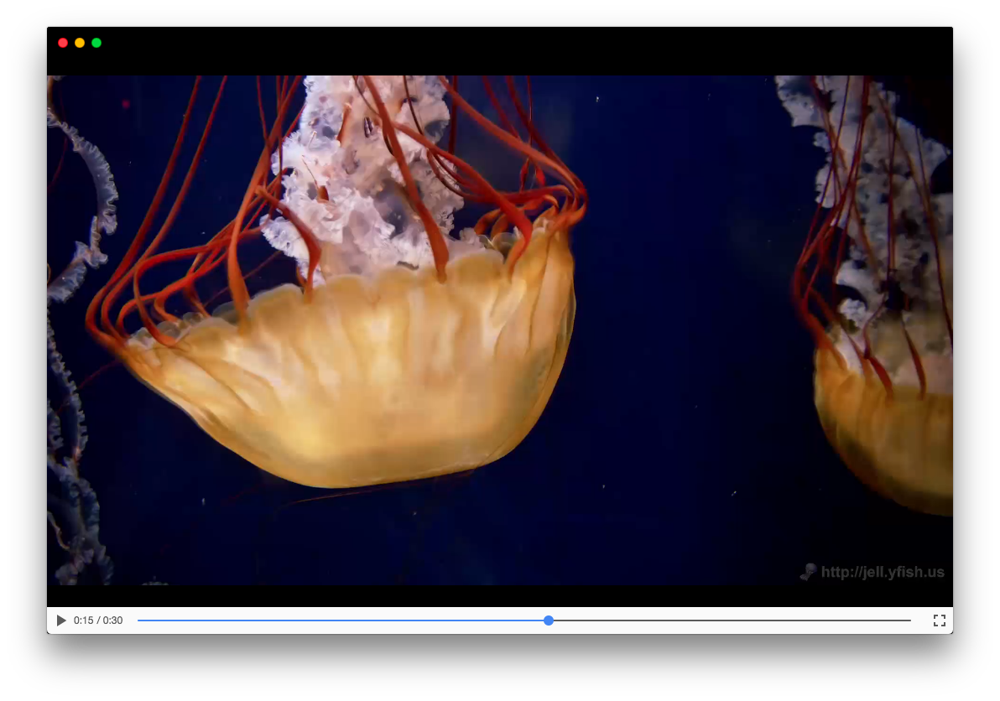

# Clapton ⛱️

> Yet Another Open Source Media Player



## About

Clapton is a Open Source Media Player.

**It's still under development.**

Then the only way to get Clapton is getting the development version, [see how to build it](#developing).

## Features

- Yet Another Open Source Media Player 🦄 🦄 🦄
- [Hackable](#hackable)
- [Torrent Stream Support](#torrent-stream-support)
- Allows multiples Source (automatic playlist)
- Chromecast Integration (only at `0.2.0` - [issue #6](https://github.com/raphamorim/clapton/issues/6))
- Airplay Integration (only at `0.2.0` - [issue #2](https://github.com/raphamorim/clapton/issues/6))
- [Suggest a feature](https://github.com/raphamorim/clapton/issues/new)

## Hackable

Clapton can load local Clappr Plugins. You only need to specify a `~/.claptonconfig` on your `$HOME`

You can create running:

```bash
$ touch $HOME/claptonconfig.json
```
Sample:

```json
{
  "defaults": {
    "theaterSource": "absolute-path-to-my-video",
    "extendStyle": "absolute-path-to-my-css-file"
  },
  "plugins": [
    "absoulute-path-to-my-plugin",
    "absoulute-path-to-my-second-plugin"
  ]
}
```

|Property         |Description|
|-----------------------|---------------------------------------|
|`theaterSource` | (string) Path to the Theater Clapton's Video|
|`extendStyle` | (string) Path to css file which overwrite [common.css](https://github.com/raphamorim/clapton/blob/master/assets/stylesheet/common.css) styles|
|`persistTorrentFiles`| (boolean, default: `false`) Persist Torrent downloaded files|

Note: `claptonconfig.json` is optional.

Note2: Plugins will be available only at `>= Clapton 0.2.0`

## Torrent Stream Support

[](https://vimeo.com/230344225 "Torrent Stream Support")

## Create a Plugin for Clapton

#### [Generator-Clappr-Plugin](https://github.com/clappr/generator-clappr-plugin)

## Migrating Clappr External Plugins to Clapton

Most part of current plugins are being tested on `Clapton 0.2.0`. Help us to integrate.

|Plugin         |Status|URL|
|-----------------------|---------------------------------------|--------------------------------------------------------|
|Thumbnails on seekbar| WIP| https://github.com/tjenkinson/clappr-thumbnails-plugin |
|Markers       | WIP| https://github.com/tjenkinson/clappr-markers-plugin |
|Level Selector| WIP| https://github.com/clappr/clappr-level-selector-plugin |
|360 videos| WIP| https://github.com/thiagopnts/video-360 |
|Chromecast| WIP| https://github.com/clappr/clappr-chromecast-plugin |
|DASH with shaka| WIP| https://github.com/clappr/dash-shaka-playback |
|Clappr Stats | WIP| https://github.com/leandromoreira/clappr-stats |
|Pause while far| WIP| https://github.com/leandromoreira/clappr-pause-tab-visibility |
|RTMP           | WIP| https://github.com/clappr/clappr-rtmp-plugin |
|Picture-in-Picture | WIP| https://github.com/tjenkinson/clappr-pip-plugin |
|Comments on seekbar| WIP | https://github.com/Metrakit/clappr-comment-plugin |
|Voice control| WIP | https://github.com/flavioribeiro/clappr-speech-control-plugin |
|Dash           | WIP | https://github.com/shankardevy/clappr-dash-plugin | |
|Youtube        | WIP | https://github.com/towerz/clappr-youtube-playback |

## Supported Formats

Version       |HLS|MP4|OGG|MKV|MP3|WEBM| DASH | RTMP | JPG/PNG/GIF |
-------------|---|---|---|---|---|----|------|------|-------------|
 0.1.8 | ✔ | ✔ | partial support* | partial support* | ✔ |  ✔ |  |  | ✔

 means that the support is made by an external plugin.

**Partial Support** means that you can play this file formats, however using a fallback player:



## Developing

Clone the project:

```bash
$ git clone https://github.com/raphamorim/clapton.git
```

Open clapton folder and then install dependencies:

```bash
$ npm install
```

Then start project

```bash
$ npm run start
```

## Credits

Clapton was created by [@raphamundi](https://twitter.com/raphamundi).

Powered by [Electron](https://github.com/electron/electron), [Clappr](github.com/clappr/clappr) and [WebTorrent](https://github.com/webtorrent/webtorrent).
